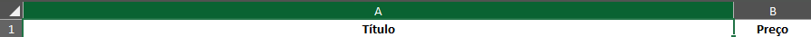
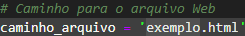
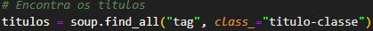
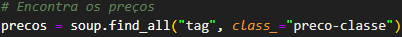
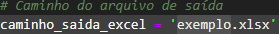

<div align="center">

# Primeira Experiência de Trabalho (Freelance): Uma Solução para a Loja de Livros: [Sebo Baleia](https://www.instagram.com/sebobaleia/)

</img> 


## Problema: Precisava de alguns dados cadastrados de um site numa planília de Excel para organizar o acervo físico

</div>

## O que eu fiz nesse Job:

1. Extrai dados de uma página Html;

>>> Baixei 4 páginas do `Acervo Virtual` para a Empresa pelo site da [Estante Virtual](https://www.estantevirtual.com.br/) que havia `713 Itens`;

2. Verifiquei um padrão com as tags `td` (table data) com as classes Html relacionadas a `Títulos` (acervo-titulo) e os `Preços` (acervo-preco text-center). Daí eu poderia:

3. Extrair títulos e os preços ([títulos.txt](Dados_Extraídos_do_Acervo_de_Livros/titulosSebo.txt) e [preços.txt](Dados_Extraídos_do_Acervo_de_Livros/precosSebo.txt));

4. Gerei [números com um contador](Dados_Extraídos_do_Acervo_de_Livros/contador.py) dependendo de cada linha no Excel;

5. E reunir os dados numa panília do Excel já ordenados em ordem 0-9 e alfabetica.

## Novidade: Melhorias no Programa

- Agora ao invés de gerar os dados em arquivos de texto
- O programa gerará os dados diretamente num arquivo Excel

## Ferramentas usadas

- [Python](https://www.python.org/) 🐍
- [BeautifulSoup4](https://www.crummy.com/software/BeautifulSoup/bs4/doc.ptbr/) 🍲
- [Chardet](https://pypi.org/project/chardet/) 🔓
- [Pandas](https://pandas.pydata.org/) 📄

## Verifique que você tenha Python, BeautifulSoup, o Chardet e o Pandas instalado:

```python
    pip install beautifulsoup4
    pip install chardet
    pip install pandas
```

## Como rodar?

- Abra um terminal e rode e comando:

```python
    python extratorDeDadosWeb.py
```

## Exemplo com uma empresa aleatória

- Código para o Exemplo: [extratorDeDadosWeb.py](extratorDeDadosWeb.py)
- Exemplo de Site: [Drogaria São Paulo](https://www.drogariasaopaulo.com.br/medicamentos/Gen%C3%A9ricos?PS=48&map=c,specificationFilter_392) 👈
- Irei pegar os títulos e preços dessa página acima irei extrair e colocar numa planília do excel com medicamentos genéricos (Preços dia 13/12/24)


## Tutorial para usar com sua página Web

1. Clone esse repositório na sua máquina local e instale o [Python](<(https://www.python.org/downloads/)>) e as bibliotecas
2. Pegue seu arquivo Html/Xml e coloque nessa pasta clonada
3. Verfique na sua página os padrões de títulos e preços (em que classe estão armenadas)
4. Altere essas linhas de código para extrair corretamente:

<div align="center">

 *`6° linha:` Altere de acordo com seu site*

 
<br><br>

*`22° linha:` Altere de acordo com a classe de títulos*


<br><br>

*`26° linha:` Altere de acordo com a classe de preços*


<br><br>

*`40° linha:` Altere de acordo com o nome que você quiser para sua planília*



</div>

